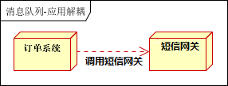
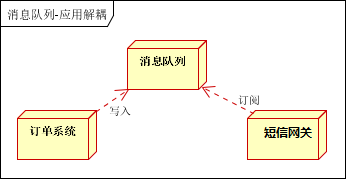
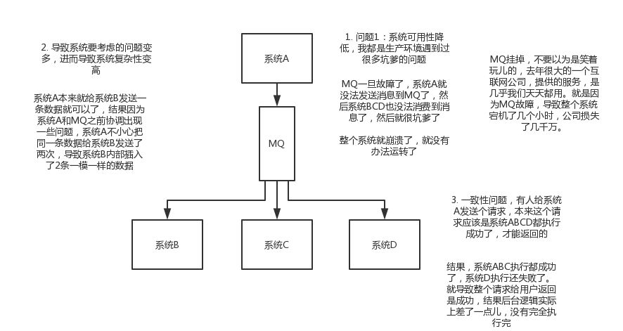

# 消息队列（MQ）系列详解之一--消息队列概述、误区、使用场景以及缺点
## 消息队列概述
　　消息队列中间件(Message Queue Middleware ，简称为MQ) 是指利用高效可靠的消息传递机制进行与平台无关的数据交流，并基于数据通信来进行分布式系统的集成。通过提供消息传递和消息排队模型，它可以在分布式环境下扩展进程间的通信。
　　消息队列中间件是分布式系统中重要的组件，主要解决应用解耦，异步消息，流量削封等问题，实现高性能，高可用，可伸缩和最终一致性架构。目前使用较多的消息队列有ActiveMQ，RabbitMQ，ZeroMQ，Kafka，MetaMQ，RocketMQ。

## 消息队列常见的使用场景
### 1、异步处理
场景说明：用户注册后，需要发注册邮件和注册短信。传统的做法有两种 1.串行的方式；2.并行方式
a、串行方式：将注册信息写入数据库成功后，发送注册邮件，再发送注册短信。以上三个任务全部完成后，返回给客户端。

b、并行方式：将注册信息写入数据库成功后，发送注册邮件的同时，发送注册短信。以上三个任务完成后，返回给客户端。与串行的差别是，并行的方式可以提高处理的时间

假设三个业务节点每个使用50毫秒钟，不考虑网络等其他开销，则串行方式的时间是150毫秒，并行的时间可能是100毫秒。
因为CPU在单位时间内处理的请求数是一定的，假设CPU1秒内吞吐量是100次。则串行方式1秒内CPU可处理的请求量是7次（1000/150）。并行方式处理的请求量是10次（1000/100）
小结：如以上案例描述，传统的方式系统的性能（并发量，吞吐量，响应时间）会有瓶颈。如何解决这个问题呢？
引入消息队列，将不是必须的业务逻辑，异步处理。改造后的架构如下：

### 2、应用解耦
场景说明： 对于我们的订单系统，订单最终支付成功之后可能需要给用户发送短信积分什么的，但其实这已经不是我们系统的核心流程了。如果外部系统速度偏慢（比如短信网关速度不好），那么主流程的时间会加长很多，用户肯定不希望点击支付过好几分钟才看到结果。那么我们只需要通知短信系统“我们支付成功了”，不一定非要等待它处理完成。如下图：

 引入应用消息队列后的方案，如下图： 

订单系统：用户下单后，订单系统完成持久化处理，将消息写入消息队列，返回用户订单下单成功
库存系统：短信网关系统，采用拉/推的方式，获取下单信息，根据下单信息，进行发送短信操作
假如：在下单时即时短信网关异常，也不用等待较长时间返回异常处理结果再告知用户下单成功。因为下单后，订单系统写入消息队列就不再关心其他的后续操作了。实现订单系统与短信网关的应用解耦。
### 3、流量削峰
流量削锋也是消息队列中的常用场景，一般在秒杀或团抢活动中使用广泛。
应用场景：秒杀活动，一般会因为流量过大，导致流量暴增，应用挂掉。为解决这个问题，一般需要在应用前端加入消息队列。
a、可以控制活动的人数
b、可以缓解短时间内高流量压垮应用 

用户的请求，服务器接收后，首先写入消息队列。假如消息队列长度超过最大数量，则直接抛弃用户请求或跳转到错误页面。
秒杀业务根据消息队列中的请求信息，再做后续处理
在不使用消息队列服务器的时候，用户的请求数据直接写入数据库，在高并发的情况下数据库压力剧增，使得响应速度变慢。但是在使用消息队列之后，用户的请求数据发送给消息队列之后立即 返回，再由消息队列的消费者进程从消息队列中获取数据，异步写入数据库。由于消息队列服务器处理速度快于数据库（消息队列也比数据库有更好的伸缩性），因此响应速度得到大幅改善。通过以上分析我们可以得出消息队列具有很好的削峰作用的功能——即通过异步处理，将短时间高并发产生的事务消息存储在消息队列中，从而削平高峰期的并发事务。
因为**用户请求数据写入消息队列之后就立即返回给用户了，但是请求数据在后续的业务校验、写数据库等操作中可能失败。因此使用消息队列进行异步处理之后，需要适当修改业务流程进行配合，比如用户在提交订单之后，订单数据写入消息队列，不能立即返回用户订单提交成功，需要在消息队列的订单消费者进程真正处理完该订单之后，甚至出库后，再通过电子邮件或短信通知用户订单成功，以免交易纠纷。**这就类似我们平时手机订火车票和电影票。

### 4、日志处理
通常是用Kafka接收日志，然后结合ELK（Elasticsearch，Logstash，Kibana）进行日志分析处理。

日志采集客户端，负责日志数据采集，定时写受写入Kafka队列
Kafka消息队列，负责日志数据的接收，存储和转发
日志处理应用：订阅并消费kafka队列中的日志数据 
### 5、其他
利用延迟队列的特性，实现订单达到例如24小时未支付自动关闭的功能。

## 消息队列关于削封常见误区
　　消息队列有流量削封的作用，于是好多人以为消息队列是用来解决高并发中http请求的。
消息队列作为高并发系统解决方案中的重要一环，但是它并不是用来分发和缓存http请求的，大量客户端同一时刻发送http请求到web服务端，这里首先是采用硬件负载均衡（LVS）和nginx负载均衡相互配合进行http请求分发到不同结点，降低单web服务器的压力。这样web服务端每秒承受千万级请求的压力也不是难事，多加点结点即可。但数据库的处理能力却十分有限，即使使用SSD加分库分表，单机的处理能力仍然在万级。由于成本的考虑，我们不能奢求数据库的机器数量追上前端。
　　在电商系统中，进行商品秒杀时用户请求量会瞬时暴增，这时如果接收请求后直接操作数据库，最终会压垮数据库，最终导致整个系统崩溃掉。

## 使用消息队列的缺点

　　系统可用性降低：系统引入的外部依赖越多，越容易挂掉，本来你就是A系统调用BCD三个系统的接口就好了，人ABCD四个系统好好的，没啥问题，你偏加个MQ进来，万一MQ挂了咋整？MQ挂了，整套系统崩溃了，你不就完了么。
　　系统复杂性提高：硬生生加个MQ进来，你怎么保证消息没有重复消费？怎么处理消息丢失的情况？怎么保证消息传递的顺序性？头大头大，问题一大堆，痛苦不已。
　　一致性问题：A系统处理完了直接返回成功了，人都以为你这个请求就成功了；但是问题是，要是BCD三个系统那里，BD两个系统写库成功了，结果C系统写库失败了，咋整？你这数据就不一致了。
　　所以消息队列实际是一种非常复杂的架构，你引入它有很多好处，但是也得针对它带来的坏处做各种额外的技术方案和架构来规避掉，最好之后，你会发现，系统复杂度提升了一个数量级，也许是复杂了10倍。但是对于大型高并发的系统，还是很有必要使用的。
　　
## 使用消息队列的情况需要满足什么条件呢？
**1.生产者不需要从消费者处获得反馈**
引入消息队列之前的直接调用，其接口的返回值应该为空，这才让明明下层的动作还没做，上层却当成动作做完了继续往后走——即所谓异步——成为了可能。
**2.满足最终一致性，容许短暂的不一致性**
A跨行转账给B，A这边先进行扣款了，但是B那边没有余额没有立即增加，但是过一段时间之后，B的余额会增加，最终结果是一致的。
**3.收益大于成本**
即解耦、提速、广播、削峰这些方面的收益，超过投入的成本，如果一个业务体积和未来升级较少的系统，就没有必要选择了。
