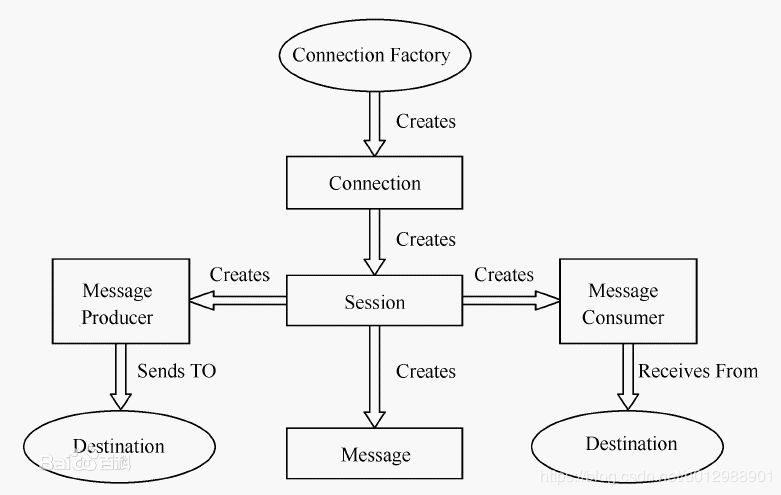
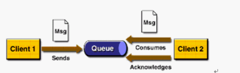

# 消息队列（MQ）系列详解之二--关键名词解释（消息、消息协议、JMS、消息模型）
## 消息
　　消息(Message) 是指在应用间传送的数据。消息可以非常简单，比如只包含文本字符串、JSON 等，也可以很复杂，比如内嵌对象。
## 消息协议
　　要想让消息发送者跟接收者都能够知道消息承载了什么信息（消息发送者如何构造发送的消息内容，消息接收者如何解析收到的消息），它们就要按照特定的格式、遵循特定的规范，而这个规范就行消息协议。
　　常见的消息协议有：MQTT、XMPP、Stomp、AMQP、OpenWire等（也有自定义协议的：Kafka、RocketMQ均使用自定义的协议。），下面对这些常见的消息协议做个简单的介绍，如果您对这些协议有兴趣的话可以找资料详细学习一下。
MQTT
MQTT（Message Queue Telemerty Transport）是一种二进制协议，主要用于服务器和那些低功耗的物联网设备（IoT）之间的通信。 它位于 TCP 协议的上层，除了提供发布－订阅这一基本功能外，也提供一些其它特性：不同的消息投递保（delivery guarantee），“至少一次”和“最多一次”。通过存储最后一个被确认接受的消息来实现重连后的消息恢复。
特点：它非常轻量级，并且从设计和实现层面都适合用于不稳定的网络环境中。
应用场景：物联网（IoT）场景中更适合，支持几乎所有语言进行开发，并且浏览器也可通过 WebSocket 来发送和接收 MQTT 消息。

XMPP
XMPP的前身是Jabber，一个开源形式组织制定的网络即时通信协议。XMPP目前被IETF国际标准组织完成了标准化工作。XMPP基于XML，用于IM系统的开发。国内比较流行的XMPP服务器叫做Openfire，它使用MINA作为下层的网络IO框架（不是MINA2是MINA1）；国外用的比较多的XMPP服务器叫做Tigase，它的官网号称单节点可以支撑50万用户在线，集群可以支持100万用户在线：（http://projects.tigase.org/）
优点：通用公开、兼容性强、可扩展、安全性高，但XML编码格式占用带宽大

STOMP
面向流文本的消息传输协议（STOMP，Streaming Text Oriented Messaging Protocol），是 WebSocket 通信标准。在通常的发布－订阅语义之上，它通过 begin/publish/commit 序列以及 acknowledgement 机制来提供消息可靠投递。
特点：协议简单且易于实现，几乎所有的编程语言都有 STOMP 的客户端实现。但是在消息大小和处理速度方面并无优势。由于在许多发布－订阅式的架构中，信息交换是基于文本的，所以许多协议选择简单地将整个信息转化为文本，从而降低复杂性并提高了可读性，当然带来的代价就是需要再消息接受后执行额外的计算任务。
应用场景：信息交换基于文本，要求简单的场景。
典型实现：ActiveMQ以及它的下一代实现Apache Apollo。

AMQP
AMQP(Advanced Message Queuing Protocol ，高级消息队列协议)是比较全面和复杂的一个协议，包括协议本身以及模型（broker、exchange、routing key等概念）。
特点：AMQP 十分可靠且功能强大。当然它及它的实现并不是足够轻量级。
应用场景：当简单的发布－订阅模型不能满足使用要求。
典型实现：RabbitMQ是AMQP消息队列最有名的开源实现。RabbitMQ同时还可以通过插件支持STOMP、MQTT等协议接入。

## JMS
　　提到MQ不得不提JMS，Java消息服务（Java Message Service，JMS）应用程序接口是一个Java平台中关于面向消息中间件（MOM）的API，用于在两个应用程序之间，或分布式系统中发送消息，进行异步通信。Java消息服务是一个与具体平台无关的API（注意：JMS并不是消息队列，它只是定义了一套接口规范），绝大多数MOM提供商都对JMS提供支持。 JMS中的P2P和Pub/Sub消息模式：点对点（point to point， queue）与发布订阅（publish/subscribe，topic）最初是由JMS定义的。这两种模式主要区别或解决的问题就是发送到队列的消息能否重复消费(多订阅)。
　　JMS是一种与厂商无关的 API，用来访问收发系统消息，它类似于JDBC(Java Database Connectivity)。这里，JDBC 是可以用来访问许多不同关系数据库的 API，而 JMS 则提供同样与厂商无关的访问方法，以访问消息收发服务。许多厂商都支持 JMS，包括 Apache的ActiveMQ、 IBM 的 MQSeries、BEA的 Weblogic JMS service和 Progress 的 SonicMQ等。 JMS 使您能够通过消息收发服务（有时称为消息中介程序或路由器）从一个 JMS 客户机向另一个 JMS客户机发送消息。消息是 JMS 中的一种类型对象，由两部分组成：报头和消息主体。报头由路由信息以及有关该消息的元数据组成。消息主体则携带着应用程序的数据或有效负载。根据有效负载的类型来划分，可以将消息分为几种类型，它们分别携带：简单文本(TextMessage)、可序列化的对象 (ObjectMessage)、属性集合 (MapMessage)、字节流 (BytesMessage)、原始值流 (StreamMessage)，还有无有效负载的消息 (Message)。

## 消息模型
在JMS标准中，有两种消息模型P2P（Point to Point）,Publish/Subscribe(Pub/Sub)。
### P2P模式

P2P模式包含三个角色：消息队列（Queue），发送者(Sender)，接收者(Receiver)。每个消息都被发送到一个特定的队列，接收者从队列中获取消息。队列保留着消息，直到他们被消费或超时。

P2P的特点
每个消息只有一个消费者（Consumer）(即一旦被消费，消息就不再在消息队列中)
发送者和接收者之间在时间上没有依赖性，也就是说当发送者发送了消息之后，不管接收者有没有正在运行，它不会影响到消息被发送到队列
接收者在成功接收消息之后需向队列应答成功
如果希望发送的每个消息都会被成功处理的话，那么需要P2P模式。
### Pub/Sub模式

包含三个角色主题（Topic），发布者（Publisher），订阅者（Subscriber） 多个发布者将消息发送到Topic，系统将这些消息传递给多个订阅者。

Pub/Sub的特点
每个消息可以有多个消费者
发布者和订阅者之间有时间上的依赖性。针对某个主题（Topic）的订阅者，它必须创建一个订阅者之后，才能消费发布者的消息
为了消费消息，订阅者必须保持运行的状态
为了缓和这样严格的时间相关性，JMS允许订阅者创建一个可持久化的订阅。这样，即使订阅者没有被激活（运行），它也能接收到发布者的消息。
如果希望发送的消息可以不被做任何处理、或者只被一个消息者处理、或者可以被多个消费者处理的话，那么可以采用Pub/Sub模型。