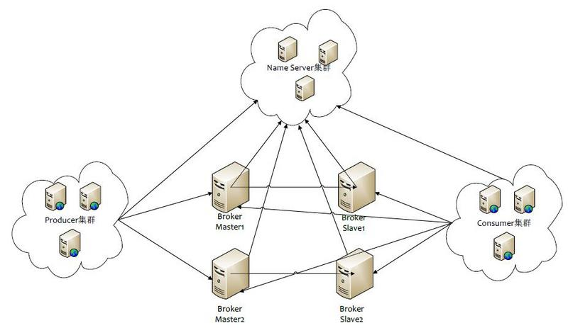
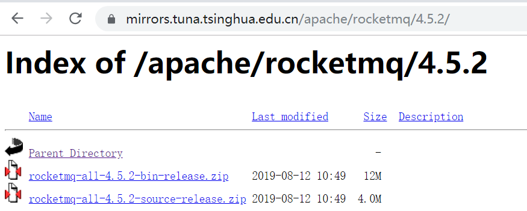
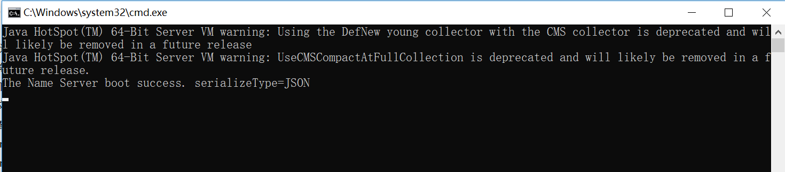
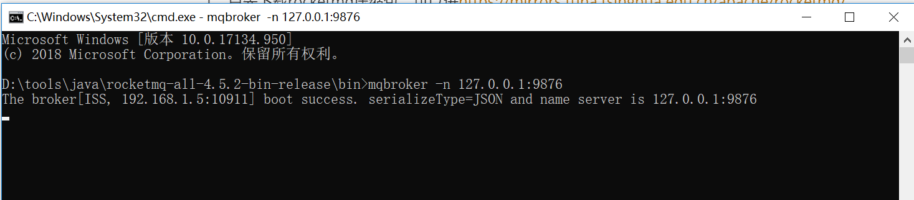

# 消息队列（MQ）系列详解之三--RocketMQ介绍与windows下单机部署
## RocketMQ整体结构与关键要素

### NameServer
可以理解为是消息队列的协调者，Broker向它注册路由信息，同时Client向其获取路由信息，如果使用过Zookeeper，就比较容易理解了，但是功能比Zookeeper弱；
NameServer本身是没有状态的，并且多个NameServer直接并没有通信，可以横向扩展多台，Broker会和每一台NameServer建立长连接；
### Broker
Broker是RocketMQ的核心，提供了消息的接收，存储，拉取等功能，一般都需要保证Broker的高可用，所以会配置Broker Slave，当Master挂掉之后，Consumer然后可以消费Slave；
Broker分为Master和Slave，一个Master可以对应多个Slave，Master与Slave的对应关系通过指定相同的BrokerName，不同的BrokerId来定义，BrokerId为0表示Master，非0表示Slave；
## Windows下的单机部署
1、首先下载rocketmq压缩包，可以进https://mirrors.tuna.tsinghua.edu.cn/apache/rocketmq/ 
下载对应的版本，我这里使用的4.5.2版本

下载rocketmq-all-4.5.2-bin-release.zip并解压。

2、配置rocketmq环境变量

 ROCKETMQ_HOME=rocketmq解压目录 

3、启动nameserver 

 在ROCKETMQ_HOME/bin目录下双击运行mqnamesrv.cmd，出现如下信息表示启动成功，保持命令窗口开启（若窗口一闪而过，说明没有配置环境变量，请先配置环境变量） 

出现下图代表启动成功，启动完成后不要关闭这个终端。默认端口为9876

4、启动broker
开启另一个windows终端cmd，进入ROCKETMQ_HOME/bin目录，输入mqbroker -n 127.0.0.1:9876启动broker，保持mqbroker运行，不要关闭这个终端

出现上图，表示broker启动成功，默认端口为10911；

至此，单机上部署rocketmq完毕，下面我们可以编写生产这和消费者代码进行测试了。具体请看下篇讲解。